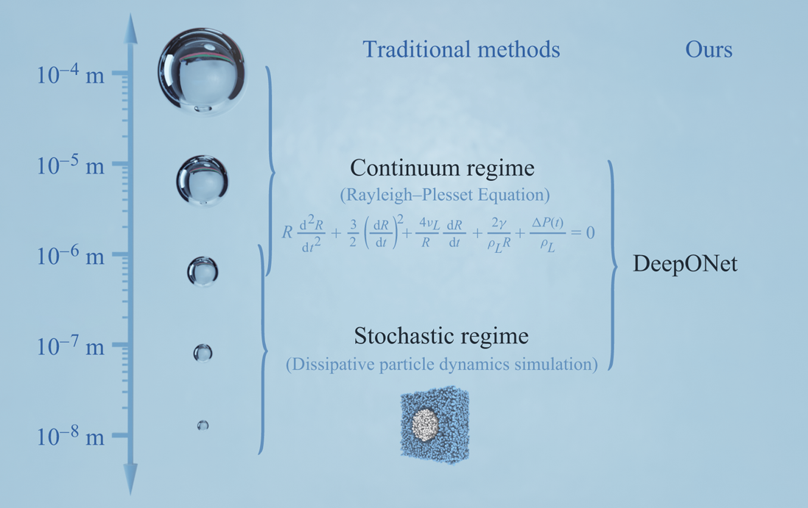

# Different PINNs

### Gradient-Enhanced PINN

One can also formulate the inverse problem. 

Advantages with specific application, z.B.: Schrodinger eq. Think about limitations as well. 

### Fractional PINN

Do you remember fractional calculus? 

One application is the fractional diffusion-reaction (Gray-Scott) model. 

There's an 'issue' with these problems, since automatic differentiation cannot be used for this PINN. 
Thus, one must change the collocation points to a random positioning of points. 

### Bayesian-PINN (B-PINN)

One can have a closer look at the uncertainty: discern between epistemic and random. 

Reference: [B-PINNs: Bayesian physics-informed neural networks for forward and inverse PDE problems with noisy data](https://www.sciencedirect.com/science/article/pii/S0021999120306872)

A comparsion between all the possible PINNs so far; z.B. 

### Conservative-PINN (cPINN)

Makes sure that conservation laws are preserved. 

[Conservative physics-informed neural networks on discrete domains for conservation laws: Applications to forward and inverse problems](https://www.sciencedirect.com/science/article/pii/S0045782520302127)

* "cPINN is only for space-domain decomposition."

* "xPINN is an extension of the cPINN as it can be used for time-domain decomposition as well."

* "$PINN, the combination of BPINN with cPINN", developed in KTH, last year.
    * Could deal with noisy data.
    * It has been used for Fokker–Planck equation.

### PINN for Domain decomposition

[Machine learning and domain decomposition methods -- a survey](https://arxiv.org/abs/2312.14050)

Some issues with PINNs are the uncertainty and the scalability. 

# PROGRAMMING PHYSICS-INFORMED NEURAL NETWORKS WITH GPUs, S. Markidis

Content:
1. A PINN from Scratch with PyTorch
    * IMPORTANT TO MAKE SURE THAT YOUR PROBLEM IS WELL DEFINED. Otherwise, the numerical stability may be impacted. 
2. Porting our PINN to GPUs
3. Measuring performance of the PINN

### A PINN from Scratch with PyTorch

BENCHMARK PROBLEM: Poisson on the Unit Square, 2-Dimensional. 

* Governing PDE: $\nabla^2u(x,y) = sin(2\pi x)\cdot sin(2\pi y)$
    * What makes this a well-defined problem, and not an ill-defined problem, for instance, is the presence of the $2\pi$ for the specific boundary condition. 
* Domain: $\Omega=[0,1]x[0,1]$
* Boundary condition: $u(x,y)=0$ for all edjes $\partial\Omega$.

The content of this lecture can be directly deployed to a electrocstatic plasma simulation.  

* Image comparing the MLP vs PINN. **TASK**: redo. 
* Think about: how can you study the optimization lanscape. 
    * Research example: [Exploratory Landscape Validation for Bayesian Optimization Algorithms](https://www.mdpi.com/2227-7390/12/3/426)
* Automatic differentiation:  you don't need a grid and it's a beautiful and elegant solution for the optimization problem. 
    * "It's just chain rules"

* First done in CPU and took less time to run than my two-stream instability codes. 

### Porting our PINN to GPUs

1. First, move the weights and biases of the MLP to the GPU memory; z.B.: `model = MLP().to(device)`.
    * Now, the matrix multiplications will be done in the GPU. 

2. Move the data  to the GPU: z.B.: in the specific given example: `xy_f = latin_hypercube(N_f).to(device).requires_grad_(True)
    * QUESTION: why is `latin_hypercube` needed?

3. Move the evaluation grid to GPU and after prediction, place it back to the CPU. 

* Remark: no minibatch used in this programming. 

### Measuring performance of the PINN

You can instrument the code with `torch.profiler`. 

To truly improve an algorithm, you must first have a look at the part where more time is being spent. Torch profiler helps to understand and looks for you which function is requiring most of the time. Profile the created functions. 

VISUALIZING TRACES PERFORMANCE. 

* `self CPU`: it considers the impact of other functions that were called within the function. 
* `CPU total`: it does not considers other functions, if any, at the function being studies. 

Keep in mind, whenever you call a function, you take time to call this function. Minibatch may help to decrease the computing intesity by calling other functions (I believe). One may want to even reduce the computational intensity by reducing the number of calls. He says that the first step in his example would be to implement batches and minibatches to then assess the performance improvement.  

From the shared image, the functions `mul`, `mm`, and `tanh_backward` are the ones that consume the most time. 

Does `jax` have something similar to this? `Tensorflow`? `NumPy`?  

* **ESTIMATE THE VARIANCE OF YOUR RESULT**

**local REMARK**: CPU are not good at calculating tanh, unlike GPUs, which are better prepared. 

MAIN TAKE AWAY from Dr. Markidis: do not stop at your intuition, make a structural approach as how you will analize and justify your optimization. 

Research Document: [Data-centric Engineering: integrating simulation, machine learning and statistics. Challenges and opportunities](https://www.sciencedirect.com/science/article/pii/S0009250921008368)

Highlights
* Overview of bottlenecks in update of AI and ML in traditional engineering.
* Overview of the current approaches to integration of data, models, and AL/ML.
* Perspectives on emerging research areas at the nexus of simulations, statistics, and AI/ML.
* Future challenges.

# DEEP LEARNING FOR SCIENTIST AND ENGINEERS
## Neural Operators, DeepONets, K. Shukla.

So, what is a NN? A function --> that learns a function. Can we learn functionals? 

### Can Neural Networks Approximate Functionals? :: LSTM

Theorem available to design NN-operatpr architectures.

#### REFERENCES
* [Approximations of continuous functionals by neural networks with application to dynamic systems](https://ieeexplore.ieee.org/document/286886) Hard to get. 
* **DeepOperator Network (DeepONet)**
    * [DeepONet: Learning nonlinear operators for identifying differential equations based on the universal approximation theorem of operators](https://arxiv.org/abs/1910.03193)
        * So, I was wondering about the size of $x$ te create $sin(x)$. 

* How do you implement production level DeepONet algorithms? 

For each epoch, you run each batch? Get rid of for loops and noise in the gradient is reduced (?)

* It is even possible to leanr fractional differential operators. Usually, fractional operations are used when you have a memory in the system. The current point of analysis, depends on the previous state of stress, so analyses rely on convolutions. 
    * An example is the study of blood in veins / arteries (blood is both newtonian and non-newtonian fluid, thepending on the size of the artery.)

**BUBBLE EXAMPLE**: the ouput of the deeponet is a time-series data (if I understood correctly). 

Graph neural networksto learn data from MD simulations to the use as input. 
* HERE YOU WILL FIND THE REFERENCE OF THIS TYPE OF INPUT DATA
    * [A seamless multiscale operator neural network for inferring bubble dynamics](https://www.cambridge.org/core/journals/journal-of-fluid-mechanics/article/seamless-multiscale-operator-neural-network-for-inferring-bubble-dynamics/D516AB0EF954D0FF56AD864DB2618E94): uses MD simulations

#### PHYSICS-INFORMED DEEPONET
Physics-Informed DeepONet:: VERY USEFUL WHEN THERE'S LITTLE DATA BUT YOU KNOW THE PHYSICS. 

# GLOBAL

**GLOBAL REMARKS AND KEYWORDS**

* Remember that you can also have a look at the different induced errors/ uncertainty: numerical, random, epistemic, etc. 
* Neural Architecture Search
    * Neural Architecture Search: Insights from 1000 Papers: [arXiv:2301.08727](https://arxiv.org/abs/2301.08727)
    * Federated Neural Architecture Search with Model-Agnostic Meta Learning [arXiv:2504.06457](https://arxiv.org/abs/2504.06457)
    * LAMANAS: loss agnostic and model agnostic meta neural architecture search for few shot learning [link](https://cs229.stanford.edu/proj2021spr/report2/82285254.pdf)

**GLOBAL QUESTIONS**

* What are collocation points in these contexts?
* What is a surrogate model? 
* Why use batches? Memory comsumption + randomization (for faster convergence). 
    * How do you compare batches with CV? 
* What is the Gibbs phenomena and how does it relates to the numerical stability of solvers? 

* **EXPLAIN WHY** ReLu is bad for PINNs, especially if there's a second derivative to be addressed. 

